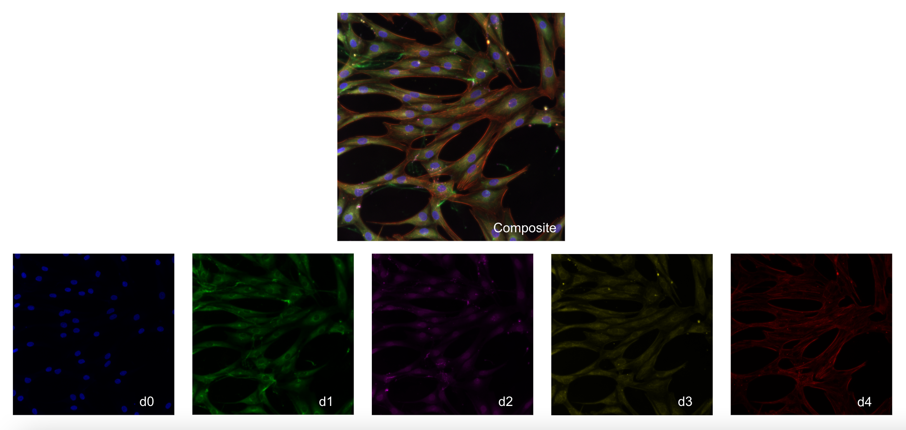
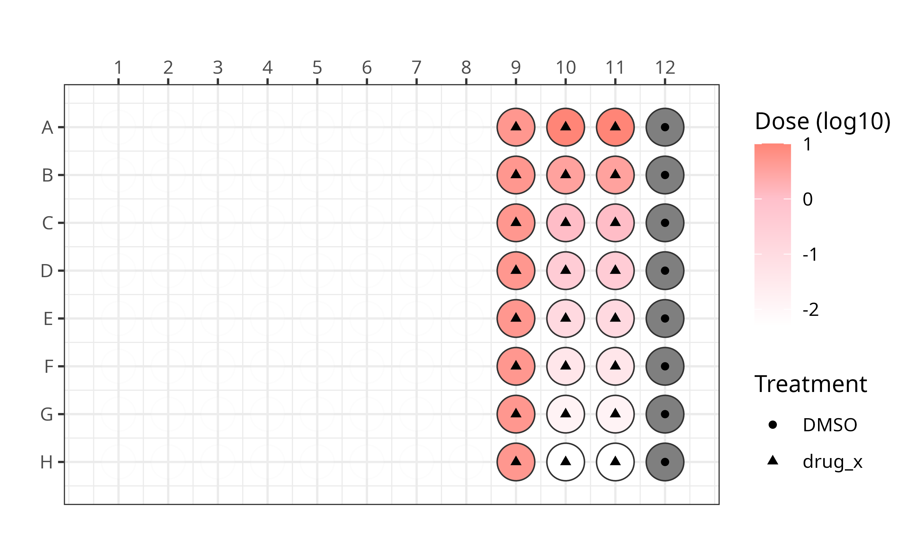

# CFReT Project

## Data

The data used in this project is a modified [Cell Painting assay](https://www.moleculardevices.com/applications/cell-imaging/cell-painting#gref) on [cardiac fibroblasts](https://www.ncbi.nlm.nih.gov/pmc/articles/PMC5588900/#:~:text=Definition%20by%20function,%2C%20and%20glycoproteins5%2C6.) from 3 patients that suffered from cardiac arrest. 

In this modified Cell Painting, there are five channels:

- `d0` (Nuclei)
- `d1` (Endoplasmic Reticulum)
- `d2` (Golgi/Plasma Membrane)
- `d3` (Mitochondria)
- `d4` (F-actin)

## Plate maps

We applied this modified Cell Painting assay using the following plate design for the first two plates:

- Plate 1 = **localhost220512140003_KK22-05-198**

- Plate 2 = **localhost220513100001_KK22-05-198_FactinAdjusted**

For the third plate, we are using the following plate design:

- Plate 3 = **localhost230405150001**

In this plate, there are only two different patients, one with a healthy heart and one that had a failing heart. 

See our [platemaps](metadata/) for more details.

## Goals

The goals of this project are:
1. To identify morphology features from cardiac fibroblasts that distinguish cardiac patients 
2. To discover a cell morphology biomarker associated with drug treatment to reverse fibrosis scarring caused by cardiac arrest.

## Repository Structure

| Module | Purpose | Description |
| :---- | :----- | :---------- |
| [0.download_data](0.download_data/) | Download CFReT pilot data | Download pilot images for the CFReT project |
| [1.preprocessing_data](1.preprocessing_data/) | Perform Illumination Correction (IC) | Use `BaSiCPy` to perform IC on images per channel |
| [2.cellprofiler_processing](2_cellprofiler_processing/) | Apply feature extraction pipeline | Extract hundreds of morphology features per imaging channel |
| [3.process_cfret_features](3.process_cfret_features/) | Get morphology features analysis ready | Apply `pycytominer` to perform single cell normalization and feature selection |
| [4.analyze_data](4.analyze_data/) | Analyze the single cell profiles to achieve goals listed above | Several independent analyses to describe data and test hypotheses |
